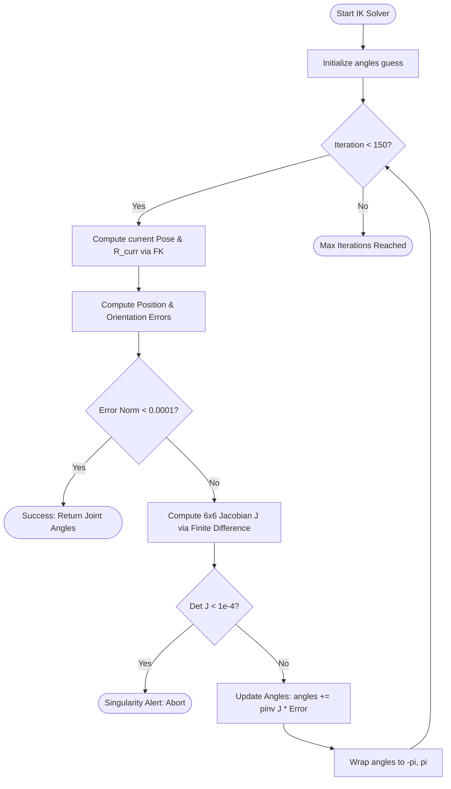

# UR5 Kinematics Engine: Code & Mathematical Walkthrough

This document analyzes the kinematics engine implemented in [ur5.py](file:///home/niranjan/Desktop/UR5/ur5.py). It covers the mathematical formulation, the algorithms used for solving kinematics, and the software architecture.

---

## 1. Kinematics Parameters (Denavit-Hartenberg)

The script defines the standard physical dimensions of the UR5 robot arm at the top of the file:
```python
d1 = 0.089159   # Link 1 offset (Base height along Z)
a2 = 0.425      # Link 2 length (Upper arm length along X)
a3 = 0.39225    # Link 3 length (Forearm length along X)
d4 = 0.10915    # Link 4 offset (Wrist 1 offset along Y/Z)
d5 = 0.09465    # Link 5 offset (Wrist 2 offset along Y/Z)
d6 = 0.0823     # Link 6 offset (Wrist 3 / End-effector offset)
```
These parameters represent the offsets and link lengths used to set up the Denavit-Hartenberg (DH) coordinate frames.

---

## 2. Mathematical Components & Functions

### A. DH Homogeneous Transformation Matrix
The [transformmatrix](file:///home/niranjan/Desktop/UR5/ur5.py#L54-L60) function builds the standard $4 \times 4$ homogeneous transform matrix $T_i^{i-1}$ from frame $i-1$ to frame $i$:

$$T_i^{i-1}(\theta, d, a, \alpha) = \begin{bmatrix} \cos\theta & -\sin\theta\cos\alpha & \sin\theta\sin\alpha & a\cos\theta \\ \sin\theta & \cos\theta\cos\alpha & -\cos\theta\sin\alpha & a\sin\theta \\ 0 & \sin\alpha & \cos\alpha & d \\ 0 & 0 & 0 & 1 \end{bmatrix}$$

```python
def transformmatrix(theta, d, a, alpha):
    return np.array([
        [np.cos(theta), -np.sin(theta)*np.cos(alpha),  np.sin(theta)*np.sin(alpha), a*np.cos(theta)],
        [np.sin(theta),  np.cos(theta)*np.cos(alpha), -np.cos(theta)*np.sin(alpha), a*np.sin(theta)],
        [0,              np.sin(alpha),                np.cos(alpha),               d],
        [0,              0,                            0,                           1]
    ])
```

### B. Forward Kinematics (FK)
The [forwardkinematics](file:///home/niranjan/Desktop/UR5/ur5.py#L62-L74) function calculates the position and orientation of the end-effector relative to the robot's base frame given six joint angles $(\theta_1, \theta_2, \theta_3, \theta_4, \theta_5, \theta_6)$.

1. **Step-by-step frame transitions:**
   * **Base to Link 1 ($T_1^0$):** Rotate $\theta_1$, translate $d_1$ along Z, rotate $\alpha = \pi/2$ around X.
   * **Link 1 to Link 2 ($T_2^1$):** Rotate $\theta_2$, translate $a_2$ along X.
   * **Link 2 to Link 3 ($T_3^2$):** Rotate $\theta_3$, translate $a_3$ along X.
   * **Link 3 to Link 4 ($T_4^3$):** Rotate $\theta_4$, translate $d_4$ along Z, rotate $\alpha = \pi/2$ around X.
   * **Link 4 to Link 5 ($T_5^4$):** Rotate $\theta_5$, translate $d_5$ along Z, rotate $\alpha = -\pi/2$ around X.
   * **Link 5 to Link 6 ($T_6^5$):** Rotate $\theta_6$, translate $d_6$ along Z.
2. **Cumulative Multiplication:**
   $$T_6^0 = T_1^0 \cdot T_2^1 \cdot T_3^2 \cdot T_4^3 \cdot T_5^4 \cdot T_6^5$$
3. **Extraction:**
   * **Position $(x, y, z)$:** Extracted from the translational components `t0_6[0:3, 3]`.
   * **Orientation $R$ ($3 \times 3$):** Extracted from the rotation components `t0_6[0:3, 0:3]`.

---

## 3. Numerical Inverse Kinematics (IK)

The [inversekinematics](file:///home/niranjan/Desktop/UR5/ur5.py#L83-L138) function solves for joint angles given a target 3D position $(p_x, p_y, p_z)$ and orientation (expressed as Roll-Pitch-Yaw angles). 

Because calculating analytical (closed-form) solutions for general DH configurations can be algebraically complex, this solver implements an **iterative Newton-Raphson numerical scheme** utilizing the Jacobian:



### Orientation Error Formulation
To align the orientation, the solver computes the relative rotation error matrix $R_{err} = R_{target} \cdot R_{current}^T$.
The orientation error vector $e_{ori}$ is extracted from the skew-symmetric components of $R_{err}$:
$$e_{ori} = \frac{1}{2} \begin{bmatrix} R_{err}(3,2) - R_{err}(2,3) \\ R_{err}(1,3) - R_{err}(3,1) \\ R_{err}(2,1) - R_{err}(1,2) \end{bmatrix}$$

### Finite-Difference Jacobian
A $6 \times 6$ Jacobian matrix maps joint velocities to Cartesian velocities. The script approximates the columns of the Jacobian $J$ using numerical finite-differences:
$$J_i \approx \frac{FK(\theta + \delta \cdot \hat{e}_i) - FK(\theta)}{\delta}$$
where $\delta = 0.0001$ and $\hat{e}_i$ is the unit vector for joint $i$.

The joint angles are updated at each step using the Moore-Penrose pseudo-inverse ($J^\dagger$):
$$\Delta \theta = J^\dagger \cdot e_{total}$$

---

## 4. Jacobian & Singularity Detection

In [compute_jacobian](file:///home/niranjan/Desktop/UR5/ur5.py#L140-L160), the full $6 \times 6$ matrix is computed.
* **Singularity Condition:** A singularity occurs when the robot loses one or more degrees of freedom (e.g., when the arm is fully extended or when two axes align). 
* **Detection:** This is checked using the determinant of the Jacobian $\det(J)$. If $|\det(J)| < 10^{-4}$, the matrix is near-singular (rank-deficient), meaning joint velocities would have to approach infinity to produce certain Cartesian movements.

---

## 5. Matplotlib 3D Robot Visualizer

The [visualize_robot](file:///home/niranjan/Desktop/UR5/ur5.py#L11-L53) function calculates coordinates for every link by multiplying frame transforms sequentially:
* $P_{base} = [0, 0, 0, 1]^T$
* $P_1 = T_1 \cdot P_{base}$
* $P_2 = T_1 T_2 \cdot P_{base}$
* ... up to $P_6 = T_1 T_2 T_3 T_4 T_5 T_6 \cdot P_{base}$

It plots these points in 3D using `matplotlib.pyplot` and saves the result as `ur5_skeleton.png` for review.
